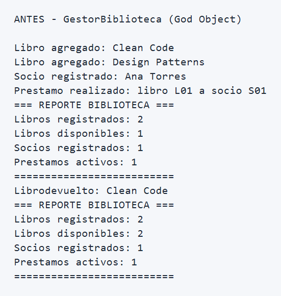
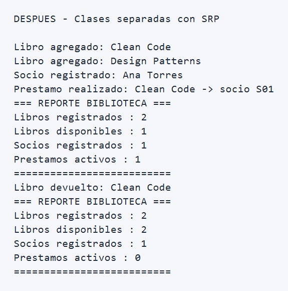

# Refactoring Lab - Gestor de Biblioteca

Proyecto academico para identificar un antipatron de diseno y aplicar una refactorizacion guiada por el principio SRP.

## Antipatron identificado

El sistema presentaba el antipatron **God Object**, concentrado en la clase `GestorBiblioteca`. Esta clase reunia demasiada logica de negocio y tambien administraba el estado de distintos dominios usando arreglos de `String[]`.

Esto provocaba varios problemas:

- Alto acoplamiento entre catalogo, socios, prestamos y reportes.
- Baja cohesion, porque una sola clase cambiaba por muchas razones distintas.
- Mayor dificultad para probar, mantener y extender el sistema.
- Mas riesgo de errores al mezclar reglas de negocio de areas diferentes.

## Responsabilidades encontradas

- **Responsabilidad 1:** Gestion del catalogo de libros (`agregar`, `buscar`, `listar`)
- **Responsabilidad 2:** Gestion de socios (`registrar`, `validar`, `buscar`)
- **Responsabilidad 3:** Gestion de prestamos (`prestar`, `devolver`)
- **Responsabilidad 4:** Generacion de reportes del sistema

## Patron aplicado

Se aplico el principio **SRP (Single Responsibility Principle)** para dividir la clase `GestorBiblioteca` en componentes con una unica responsabilidad:

- `CatalogoLibros`: administra el catalogo y la disponibilidad de libros.
- `RegistroSocios`: registra y valida socios.
- `ServicioPrestamos`: coordina prestamos y devoluciones.
- `GeneradorReportes`: construye el reporte general del sistema.
- `Libro` y `Socio`: representan las entidades del dominio.

Con esta separacion, cada clase tiene un motivo de cambio bien definido y el codigo queda mas claro, mantenible y reutilizable.

## Estructura despues de la refactorizacion

```text
src/main/java/com/universidad/antipatrones/refactoring_lab/
|- GestorBiblioteca.java
|- CatalogoLibros.java
|- RegistroSocios.java
|- ServicioPrestamos.java
|- GeneradorReportes.java
|- Libro.java
|- Socio.java
|- RefactoringLabApplication.java
```

## Ejecucion antes y despues

### Antes de la refactorizacion

La ejecucion inicial dependia de `GestorBiblioteca` como objeto central que resolvia todo el flujo del sistema.



### Despues de la refactorizacion

La misma funcionalidad se conserva, pero ahora el flujo se distribuye entre clases especializadas siguiendo SRP.



## Tecnologias

- Java 17
- Spring Boot 4.0.6
- Maven Wrapper (`mvnw`, `mvnw.cmd`)

## Como ejecutar

### Windows PowerShell

```powershell
.\mvnw.cmd spring-boot:run
```

### Ejecutar pruebas

```powershell
.\mvnw.cmd test
```

## Nota

Las capturas del README muestran la salida relevante del flujo de ejecucion antes y despues de la refactorizacion, enfocadas en el comportamiento observable del sistema.
